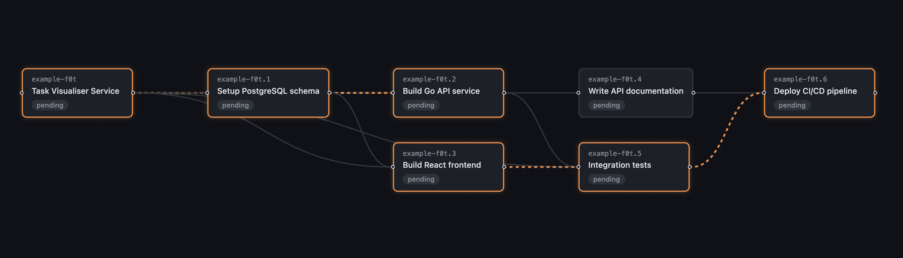

# Beadloom

Orchestrate parallel task execution across Claude Code sessions using [Beads](https://github.com/steveyegge/beads) task graphs.

Beadloom reads a task graph from a Beads database, computes critical paths and parallelizable work, then spawns multiple Claude Code sessions across git worktrees to execute tasks concurrently. It turns your project's issue backlog into an automated, parallel execution pipeline.

## Prerequisites

- [Go](https://go.dev/) 1.23+
- [Beads](https://github.com/steveyegge/beads) (`bd` CLI) installed and initialized in your repo
- [Claude Code](https://claude.ai/claude-code) CLI (`claude`) installed
- `ANTHROPIC_API_KEY` environment variable (required for `infer-deps` command)

## Installation

```bash
go install github.com/joshharrison/beadloom/cmd/beadloom@latest
go install github.com/joshharrison/beadloom/cmd/bdl@latest
```

Or build from source:

```bash
git clone https://github.com/joshharrison/beadloom
cd beadloom && make install
```

> `bdl` is a shorthand alias — both commands are identical.

## Quick Start

```bash
# 1. Make sure your repo has beads initialized
bd status

# 2. See what beadloom would do
beadloom plan

# 3. Preview without executing
beadloom run --dry-run

# 4. Execute (agents run with --dangerously-skip-permissions by default)
beadloom run

# 5. Or run in safe mode (agents will prompt for permissions)
beadloom run --safe
```

## Example Walkthrough

Suppose you have a project with these beads tasks and dependencies:

```
bd-001  Setup database schema
bd-002  Build API endpoints         (blocked by bd-001)
bd-003  Build frontend components   (blocked by bd-001)
bd-004  Write API docs              (blocked by bd-002)
bd-005  Integration tests           (blocked by bd-002, bd-003)
bd-006  Deploy pipeline             (blocked by bd-005)
```

Running `bdl plan` produces:

```
🎯 Beadloom Execution Plan
═══════════════════════════

Tasks:     7 open, 6 blocked
⚡ Critical path: bvis-o3t → bvis-o3t.1 → bvis-o3t.2 → bvis-o3t.3 → bvis-o3t.5 → bvis-o3t.6 (6 tasks, est. 5 units)
Waves:     5
Parallel:  4 (2 tasks in widest wave)

🌊 Wave 1 (1 tasks, independent):
  bvis-o3t  Beadloom Graph Visualiser (React)  ⚡ critical

🌊 Wave 2 (1 tasks, after wave 1):
  bvis-o3t.1  Define Beadloom graph JSON contract  ⚡ critical

🌊 Wave 3 (2 tasks, after wave 2):
  bvis-o3t.2  Build minimal API endpoint for graph JSON  ⚡ critical
  bvis-o3t.3  Build React UI for graph + CPA display  ⚡ critical

🌊 Wave 4 (2 tasks, after wave 3):
  bvis-o3t.5  Integration tests (API + UI)  ⚡ critical
  bvis-o3t.4  Write usage docs

🌊 Wave 5 (1 tasks, after wave 4):
  bvis-o3t.6  Deploy pipeline  ⚡ critical
```

Beadloom identifies that:
- **Wave 1** must run first (schema has no dependencies)
- **Wave 2** must run JSON contract for graph next (only depends on schema)
- **Wave 3** can run API and UI **in parallel**
- **Wave 4** can write integration tests and docs **in parallel**
- **Wave 5** The deployment pipeline is the final step
- The **critical path** is schema -> API -> tests -> deploy (any delay here delays everything)

Running `beadloom run --max-parallel 2` then:

1. Creates a git worktree for `bd-001` via `bd worktree create`
2. Spawns a Claude Code session in that worktree with a generated prompt
3. Waits for the agent to finish and run `bd close bd-001`
4. Creates worktrees for `bd-002` and `bd-003`, spawns agents in parallel
5. Continues wave by wave until all tasks complete or a critical task fails

During execution, `beadloom status` shows:

```
   |  o  o  o  o  o  o  o  o  |
   |  |  |  |  |  |  |  |  |  |
   |==========================|
   |  B  E  A  D  L  O  O  M  |
   |==========================|
   |  |  |  |  |  |  |  |  |  |
   |  o  o  o  o  o  o  o  o  |
   +--------------------------+
   🧵 Parallel task orchestration

🚀 Beadloom: executing 7 tasks in 5 waves

🚀 Dynamic scheduler started (7 tasks, max 4 parallel)
  ▶ [bvis-o3t] Beadloom Graph Visualiser (React)
  [bvis-o3t] 🔧 $ List current worktree contents
  [bvis-o3t] 🔧 $ Check recent git history
  [bvis-o3t] 🔧 $ Show full issue details
  [bvis-o3t] 📖 Reading beadloom_visualiser/.worktrees/bvis-o3t/README.md
  [bvis-o3t] 🔧 $ Show all child issue details
  [bvis-o3t] 🔧 $ Show issues ready to work on
  [bvis-o3t] 🔧 EnterPlanMode
  [bvis-o3t] 💬 Let me explore the codebase and understand what we're working with, then design the implementation.
  [bvis-o3t] 🤖 Spawning agent: Explore beadloom project structure
  [bvis-o3t] 🔧 $ List all files including hidden in worktree root

```

## Commands

### `beadloom plan`

Analyze the task graph and compute an execution plan:

```bash
beadloom plan                          # show execution plan
beadloom plan --max-parallel 3         # limit parallelism in plan
beadloom plan --filter "label=backend" # only include matching tasks
beadloom plan --filter "priority<=1"   # filter by priority
beadloom plan --filter "type=bug"      # filter by issue type
beadloom plan --json                   # machine-readable output
beadloom plan --output plan.json       # save plan to file
```

### `beadloom run`

Execute the plan (or plan + run in one shot):

```bash
beadloom run                           # plan and execute
beadloom run --safe                    # agents require permission approval
beadloom run --plan plan.json          # run from saved plan
beadloom run --max-parallel 2          # limit concurrent agents
beadloom run --timeout 45m             # per-task timeout
beadloom run --dry-run                 # show what would happen
beadloom run --quiet                   # suppress streaming agent output
beadloom run --automerge               # merge branches at wave boundaries
beadloom run --automerge --git-trace   # log every git command for debugging
```

In dynamic mode (the default), after a successful run you will be prompted to merge pending branches interactively.

### `beadloom status`

Monitor running sessions:

```bash
beadloom status                        # show current progress
beadloom status --watch                # auto-refresh every 5s
beadloom status --logs bd-a1b2         # show logs for a specific task
beadloom status --previous             # show most recent completed run
beadloom status --plan <id>            # show a specific historical run
beadloom status --json                 # machine-readable output
```

### `beadloom cancel`

Abort running sessions:

```bash
beadloom cancel                        # cancel all (SIGTERM)
beadloom cancel bd-a1b2                # cancel specific task
beadloom cancel --force                # SIGKILL instead of SIGTERM
```

### `beadloom merge`

Merge completed worktree branches and clean up:

```bash
beadloom merge                         # squash-merge all completed branches
beadloom merge --no-squash             # use regular merge commits instead
beadloom merge --no-cleanup            # skip worktree and branch cleanup
beadloom merge --dry-run               # show what would be merged
```

If a bd sync branch is configured (`bd init --branch`), beads metadata is automatically synced after merging.

### `beadloom summarise`

Print a structured run summary (alias: `summarize`):

```bash
beadloom summarise                     # summarise the current/last run
beadloom summarise --previous          # summarise most recent completed run
beadloom summarise --plan <id>         # summarise a specific historical run
beadloom summarise --include-agent-results  # send agent logs to Claude for a narrative summary
beadloom summarise --model claude-sonnet-4-6 # model override for narrative
```

### `beadloom infer-deps`

Use Claude to infer task dependencies from titles:

```bash
beadloom infer-deps                    # dry-run: show inferred deps
beadloom infer-deps --apply            # write deps to beads via bd dep add
beadloom infer-deps --model claude-sonnet-4-6  # use a specific model
beadloom infer-deps --from-file deps.json     # replay saved results without calling Claude
beadloom infer-deps --json             # machine-readable output
```

Sends open task summaries (ID, title, priority, type) to Claude, which returns dependency edges with reasons. Edges are validated (unknown IDs and self-deps are dropped) and checked for cycles before being applied. Use `--from-file` to replay previously saved results without calling Claude. Useful for bootstrapping a dependency graph on a project with many independent tasks.

Requires the `ANTHROPIC_API_KEY` environment variable to be set (unless using `--from-file`).

### `beadloom viz`

Visualize the task dependency graph:

```bash
beadloom viz                           # ASCII DAG in terminal
beadloom viz --format dot > graph.dot  # Graphviz DOT format
dot -Tsvg graph.dot > graph.svg        # render with Graphviz
```

### `beadloom view`

Open an interactive browser visualiser (React Flow) for the execution plan:

```bash
beadloom view                          # start server, POST plan, open browser
beadloom view --no-open                # start server + POST plan, skip browser
beadloom view --port 4000              # custom server port (default 7171)
beadloom view --filter "label=backend" # filter tasks before viewing
```



The visualiser frontend is embedded in the Go binary — no Node.js runtime required. A single HTTP server serves both the API and the SPA. Subsequent runs detect the running server and just POST the latest plan.

## How It Works

1. **Graph Building** -- Queries `bd list --json --status open` for all open tasks, then `bd dep list <id>` for each to build a directed acyclic graph (DAG). Detects cycles defensively.
2. **Critical Path Analysis** -- Runs the Critical Path Method (CPM): Kahn's topological sort, forward pass (earliest start/finish), backward pass (latest start/finish), slack calculation. Tasks with zero slack form the critical path.
3. **Wave Computation** -- Groups tasks by earliest start time into parallel waves. Tasks in the same wave have no inter-dependencies and can run concurrently.
4. **Execution** -- By default, uses a dynamic scheduler that dispatches tasks the moment all predecessors complete. With `--automerge`, switches to wave-barrier mode: all tasks in wave N complete, their changes are auto-committed, then their branches are squash-merged into the current branch before wave N+1 starts. Creates git worktrees via `bd worktree create` (which sets up beads database redirects automatically) and spawns Claude Code sessions with generated prompts. Critical path failures halt the pipeline; non-critical failures log warnings and continue. Use `--git-trace` to log every git command and its output for debugging merge issues. If a bd sync branch is configured, beads metadata is automatically synced at the end of the run.
5. **Reporting** -- Real-time terminal status, JSON output, persistent state in `.beadloom/state.json` (works across terminal sessions).

## Global Flags

| Flag | Default | Description |
|------|---------|-------------|
| `--db <path>` | auto-discover | Beads database path (passed through to `bd`) |
| `--max-parallel <n>` | `4` | Max concurrent agent sessions |
| `--safe` | `false` | Don't pass `--dangerously-skip-permissions` to Claude |
| `--timeout <duration>` | `30m` | Per-task timeout |
| `--worktree-dir <path>` | `.worktrees/` | Directory for git worktrees |
| `--prompt-template <path>` | built-in | Custom agent prompt template |
| `--json` | `false` | Machine-readable output |

## Custom Prompt Templates

Override the default agent prompt with a Go `text/template` file:

```bash
beadloom run --prompt-template my-prompt.tmpl
```

Available template variables:

| Variable | Description |
|----------|-------------|
| `{{.TaskID}}` | Beads issue ID (e.g., `bd-001`) |
| `{{.Title}}` | Issue title |
| `{{.Description}}` | Issue description |
| `{{.Acceptance}}` | Acceptance criteria |
| `{{.Design}}` | Design notes |
| `{{.Notes}}` | Additional notes |
| `{{.WorktreePath}}` | Path to the git worktree |
| `{{.BranchName}}` | Git branch name (e.g., `beadloom/bd-001`) |
| `{{.WaveIndex}}` | Wave number (0-indexed) |
| `{{.WaveSize}}` | Number of tasks in this wave |
| `{{.IsCritical}}` | Whether this task is on the critical path |

See `templates/default.prompt.tmpl` for the default template. Agents are instructed to run `bd close <id>` on completion and `bd update <id> --status blocked` if stuck.

## bd Compatibility

Beadloom is tested against `bd` v0.52+. It uses these `bd` commands:

| Command | Purpose |
|---------|---------|
| `bd list --json --status open --limit 0` | Fetch all open tasks |
| `bd dep list <id> --json` | Get task dependencies (blockers) |
| `bd dep list <id> --direction=up --json` | Get task dependents (what it blocks) |
| `bd worktree create <path> --branch <name>` | Create isolated worktree with beads redirect |
| `bd worktree remove <path>` | Clean up worktree |
| `bd worktree list --json` | List existing worktrees |
| `bd close <id> --reason "..."` | Mark task as done |
| `bd update <id> --status blocked --append-notes "..."` | Mark task as blocked |
| `bd ready --json --limit 0` | List ready (unblocked) tasks |
| `bd dep add <blocked> <blocker>` | Add a dependency edge |
| `bd config get sync.branch` | Detect protected-branch sync configuration |
| `bd sync --status` | Show pending metadata changes on sync branch |
| `bd sync --merge` | Merge sync branch into main |

## Architecture

```
beadloom/
├── cmd/
│   ├── beadloom/           # CLI entry point (stub → internal/cli)
│   └── bdl/                # Shorthand alias (stub → internal/cli)
├── internal/
│   ├── cli/                # Shared CLI logic (cobra commands, flags, helpers)
│   ├── bd/                 # bd CLI wrapper (list, show, dep, worktree, close)
│   ├── claude/             # Claude API client (dependency inference, run summaries)
│   ├── graph/              # Task DAG builder + cycle detection
│   ├── cpm/                # Critical Path Method analyzer
│   ├── planner/            # Execution plan + prompt generation
│   ├── worktree/           # Git worktree lifecycle management
│   ├── orchestrator/       # Wave execution engine + Claude agent spawning
│   ├── reporter/           # Terminal status display + JSON output
│   ├── state/              # Persistent state (.beadloom/state.json)
│   ├── viewer/             # Embedded HTTP server + SPA for `beadloom view`
│   ├── ui/                 # Terminal styling + streaming output helpers
│   └── assets/             # Embedded logo asset
├── beadloom_visualiser/    # React Flow browser UI source (git submodule)
└── templates/              # Default agent prompt template
```

## Edge Cases

- **Merge conflicts**: Each worktree gets its own branch (`beadloom/<task-id>`), so no conflicts during execution. Conflicts arise at merge time. With `--automerge`, conflicts at a wave boundary halt the run so you can resolve manually. Without it, use `beadloom merge` or your normal PR workflow after the run. On Dolt-level conflicts, `bd vc conflicts` and `bd vc resolve` commands are suggested for resolution.
- **Protected branches**: If your repo uses a bd sync branch (`bd init --branch`), beadloom automatically syncs beads metadata after merging. Use `bd sync --status` to check pending changes and `bd sync --merge` to merge the sync branch into main.
- **Stale worktrees**: Beadloom detects and cleans up stale worktrees from interrupted runs automatically. If automatic cleanup fails, you can manually remove them with `bd worktree remove <path>` or `git worktree remove <path>`.
- **Agent failures**: Critical path failures halt the pipeline. Non-critical failures log warnings and continue. Failed task worktrees are preserved for inspection.
- **Database contention**: All worktrees share the same beads database (via `bd worktree` redirects). `bd` uses file-level locking for writes. Beadloom automatically retries `bd` commands that fail due to dolt lock contention (up to 3 retries with exponential backoff).
- **Resource limits**: Each Claude session consumes significant memory/API quota. Default of 4 concurrent sessions is conservative.
- **Cycle detection**: Beads shouldn't allow dependency cycles, but beadloom checks defensively and errors with the cycle path if found.

## Development

```bash
make build      # compile Go binary (frontend is pre-embedded)
make install    # go install
make build-ui   # rebuild visualiser frontend (requires Node.js 18+)
make test       # run tests
make test-v     # run tests verbose
make lint       # go vet
make clean      # remove binary and temp dirs
```
